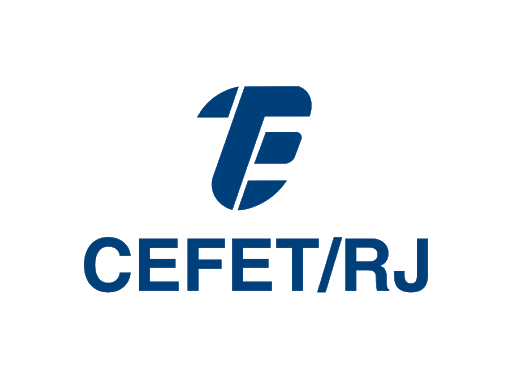
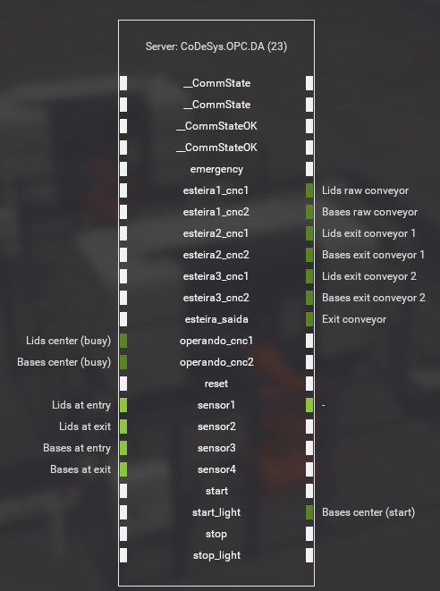
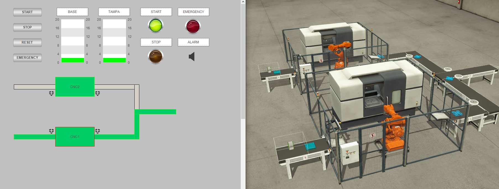
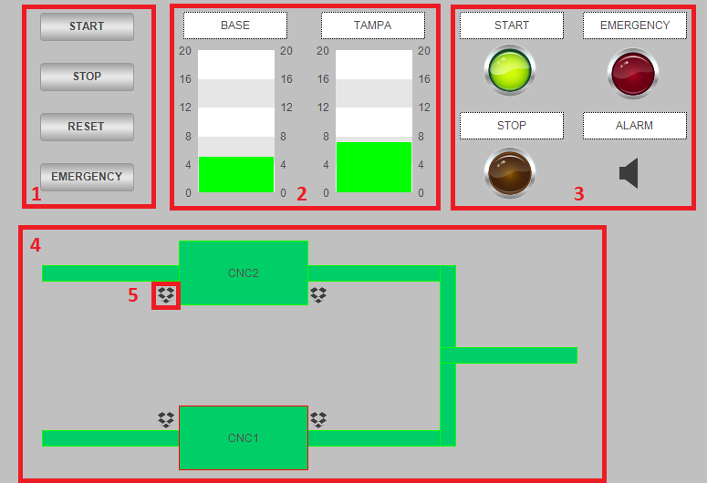
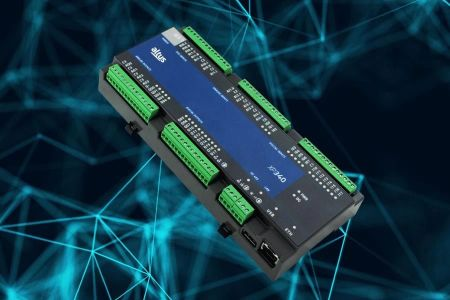
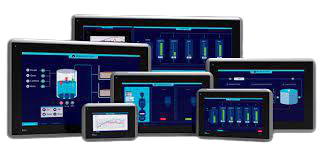
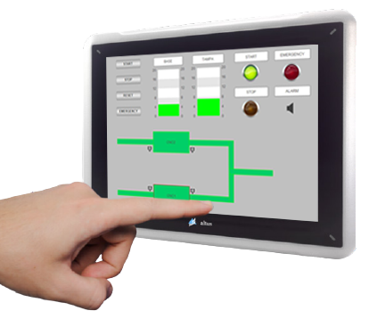

 

    
  </a>

  <h3 align="center">CENTRO FEDERAL DE EDUCAÇÃO TECNOLÓGICA CELSO SUCKOW DA FONSECA</h3>

  

   SEGUNDO RELATÓRIO PARA A DISCIPLINA DE AUTOMAÇÃO DE SISTEMAS
    

     Alunos: Caio Lima e Erick Silva  
    

     Professora: Betania Gomes da Silva Filha
  

<!-- TABLE OF CONTENTS -->

  
Sumário

  <ol>
       <li><a href="#introdução">Introdução</a>
       <li><a href="#proposta-de-projeto">Proposta de Projeto</a>
         <ul>
          <li><a href="#clp-e-ihm-escolhidos">CLP e IHM escolhidos</a></li>
          <li><a href="#protocolo-de-comunicação">Protocolo de comunicação</a></li>
          <li><a href="#tutorial-ihm">Tutorial IHM</a></li>
         </ul>
      </li>
       <li><a href="#metodologia">Metodologia</a>
      <ul>
        <li><a href="#softwares-utilizados">Softwares utilizados</a></li>
        <li><a href="#código-e-lista-de-tags">Código e Lista de Tags</a></li>
        <li><a href="#dificuldades-na-integração">Dificuldades na Integração</a></li>
      </ul>
    </li>
    <li><a href="#conclusão">Conclusão</a></li>
    <li><a href="#contato">Contato</a></li>
    <li><a href="#referências-bibliográficas">Referências Bibliográficas</a></li>
  </ol>

# Introdução

&ensp;&ensp;&ensp;&ensp;Automação de sistemas, no geral, tendem a ser soluções objetivas em conceito, porém complexas na execução. Isso porque imprevistos fora do escopo do projeto, que podem vir a afetar a funcionalidade da implementação, são normalmente difíceis de se conceituar previamente, tanto por programadores iniciantes como pelos mais experientes, o que pode acarretar problemas futuros. Dito isso, ferramentas para uma simulação mais precisa e realista dessas soluções se mostram de extrema relevância para o aprendizado de tecnologias utilizadas na indústria, um ambiente onde erros podem gerar prejuízos financeiros altos. A proposta aqui descrita consiste de um algoritmo, escrito em LADDER, de automação para o processo, um sistema supervisório, com a visão da planta indutrial e seus procesos e, por fim, a integração de ambos com o softaware Factory I/O, que permitiu a validação prática de todos esses componentes.

&ensp;&ensp;&ensp;&ensp;Neste trabalho foi usado o Master Tool IEC XE, versão 3.30, um software com funcionalidades para construir um programa em linguagens de CLP, nesse caso o LADDER, e simulá-lo em algumas situações simples. No entanto, a opção pela distribuição XE se deu pelo fato de que a mesma consegue se comunicar, via protocolo OPC, com o software Factory I/O, uma  ferramenta de simulação 3D de ambientes industriais, introduzida pela disciplina. Adicionalmente, a modalidade XE mostrou possuir ferramentas mais robustas para a construção do Sistema Supervisório.

&ensp;&ensp;&ensp;&ensp;O ambiente proposto para a situação-problema deste trabalho foi o seguinte:

[![Cena do FactoryIO proposta para o trabalho][cena-screenshot]](https://www.youtube.com/watch?v=tYJcJnaB8Tg&feature=youtu.be)

&ensp;&ensp;&ensp;&ensp;Considerando todos os fatores presentes no ambiente, o projeto foi desenvolvido com o objetivo de fornecer uma solução completa para a situação apresentada, sendo ela baseada em uma das cenas padrão do software Factory I/O. No cenário há uma linha de produção com dois equipamentos CNC, que produzem peças complementares, tampas e bases. O controle de transporte das peças deve ser feito seguindo os seguintes critérios: as esteiras só devem ser acionadas se tiverem peças passando por elas; as esteiras de entrada não devem transportar novas peças enquanto houver peças esperando para serem capturadas pelos braços mecânicos e não há preocupação com conflito no transporte pois os tempos de usinagem são diferentes.
 

 
# Proposta de projeto
&ensp;&ensp;&ensp;&ensp;Com o objetivo de contextualizar o projeto, foi recebida uma lista de entradas e atuadores, que foram levadas em consideração na construção da solução. Alguns tiveram seus nomes trocados na construção do programa, na maioria dos casos optando por uniformizar as mesmas. O programa está disponível, na íntegra, na pasta [Código](https://github.com/Erickrk/auto-industrial/tree/main/Código) deste repositório e em PDF neste [link](code.pdf). Uma exceção ocorreu com o arquivo "Archive.prj", pesado demais para o Github ele está disponível [aqui](https://drive.google.com/drive/folders/1T5UyivfZ1hsSZ5lfcdE6__ubLG7W6EIX?usp=sharing). A correspondência entre as variáveis passadas, as da cena no Factory IO e as usadas no código estão na imagem abaixo:

    

&ensp;&ensp;&ensp;&ensp;Os quatro fluxogramas abaixo descrevem o mesmo código, entretanto, optamos por separá-los com o objetivo de simplificar o entendimento dos processos. A divisão foi feita de forma que cada fluxograma inicia-se com uma das quatro entradas interativas solicitadas para o projeto, ou seja, os quatro botões que controlam o sistema como um todo, são eles: "start", "stop", "emergency" e "reset".
    

    

    

    

    

&ensp;&ensp;&ensp;&ensp;Ao realizar a integração, implementar o código e projetar o supervisório, obtivemos o seguinte resultado:

    
    
## Tutorial IHM

 

   

&nbsp;&nbsp;&nbsp;&nbsp;Para explicitar as funcionalidade do sistema supervisório criado o dividimos em 5 partes:

   
   1. Nessa seção estão localizados os botões de operação do sistema, sendo eles "start", "stop", "reset" e "emergency". Para acioná-los basta um clique simples. 
   
   2. Aqui está a visualização das contagens dos CNCs, sendo "base" a contagem referente ao cnc 1 e "tampa" referente ao cnc 2.
    
   3. Nesta parte estão as luzes do estado de operação do sistema, bem como o alarme da contagem.
   
   4. A planta do sistema esta representada nessa seção, nela podemos visualizar o estado de todas as esteiras e dos CNCs, quando inativas elas apresentam a cor cinza e quando ativas a cor verde.
   
   5. Os simbolos de caixa foram utilizadas para operação simulando a passagem dos objetos pelos sensores, cada clique representa uma mudança de estado. Portanto, o primeiro clique simula o objeto chegando ao sensor e o segundo o objeto saindo.
  
 
 
## CLP e IHM escolhidos
&nbsp;&nbsp;&nbsp;&nbsp;O CLP escolhido foi o XP340 da Altus. Ele foi preferido para o projeto por ser o mesmo controlador utilizado em [[1]](https://www.altus.com.br/base-conhecimento/categoria/19/detalhe/538/-5Bvideo-5D-nexto---integracao-com-software-factoryio-via-opc-da), o vídeo de integração do Factory IO com o Master Tool. Esse dispositivo é um lançamento relativamente recente da Altus, tendo sido anunciado como um CLP Nexto Xpress com suporte a WebServer. Dentre as suas especificidades se destaca também a possibilidade de fazer telas de supervisão e monitoramento sem um sistema SCADA.

    
    
&nbsp;&nbsp;&nbsp;&nbsp;Para mencionar as características levantadas nos relatórios anteriores, de acordo com [[2]](https://www.altus.com.br/post/294/conheca-o-xp340-2c-clp-nexto-xpress-com-suporte-a-webserver), o CLP “possui 16 entradas digitais, 16 saídas digitais à Transistor, 5 entradas analógicas V/I, 2 entradas analógicas RTD (3 fios) e 4 saídas analógicas. Projetada para atender aos requisitos de ambientes altamente conectados, a solução conta com interfaces de comunicação Serial RS 485, CAN e USB, bem como suporte a uma ampla variedade de protocolos de comunicação, como MODBUS TCP Cliente/Servidor, OPC DA e OPC UA.” e também são levantadas funcionalidade de interação com a nuvem, evidenciando esse CLP como uma poderosa ferramenta para IoT.

&nbsp;&nbsp;&nbsp;&nbsp;A IHM (Interface Homem Máquina) é uma importante ferramenta utilizada nas indústrias, que funciona como um intermediário na interação entre o operador e o maquinário, normalmente trabalhando em conjunto com um CLP, tendo diversas possibilidades de aplicação. Uma aplicação corriqueira é utilizar a IHM para coletar dados advindos do CLP e apresentá-los de maneira visual, otimizando, dessa maneira, a leitura de informações importantes dos processos analisados. 

    
 

    

&nbsp;&nbsp;&nbsp;&nbsp;Na escolha de um IHM apropriado ao projeto primeiramente consideramos o modelo de CLP determinado anteriormente, pois é necessario que eles tenham compatibilidade. Além disso, o supervisório projetado é de simples e prático uso, possuindo dimensões razoavelmente pequenas, o que nos guiou a escolher um tamanho de tela médio. Por esses fatores o aparelho escolhido foi o X2 base 7, esse modelo é da serie X2 da Altus, linha que possui arquitetura de OPC/UA. Ademais, sua operação e visualização são facilitadas pela tela touchscreen de 7 polegadas. Também possui interface de comunicação Ethernet e interfaces de comunicação serial RS-232, RS422/485 e USB.
    

    
 

   

## Protocolo de comunicação
&nbsp;&nbsp;&nbsp;&nbsp;Para a comunicação entre a IHM e o CLP foi escolhido o protocolo MODBUS/TCP. Esse protocolo já é muito bem consolidado no mercado e apresenta o modelo cliente-servidor [[3]](https://www.youtube.com/watch?v=7EhaynO6B8I&feature=youtu.be). Adicionalmente, o protocolo tem como característica a configuração simples e a fácil conversão para outros padrões. 
    
&ensp;&ensp;&ensp;&ensp;O MODBUS/TCP foi originalmente desenvolvido para os padrões RS232/485, porém na nossa solução pretendemos utilizar a Ethernet, pela mesma ser suportada por ambos os dispositivos, conforme os seus respectivos manual e catálogo, disponíveis em [[4]](https://www.google.com/url?sa=t&rct=j&q=&esrc=s&source=web&cd=&ved=2ahUKEwj7q66l7tHwAhVErJUCHVO9BxIQFjABegQIAxAD&url=https%3A%2F%2Fwww.altus.com.br%2Fsuporte%2Fdownload%2Fbaixararquivo%2FAwMLVQ%3D%3D%2F2&usg=AOvVaw1clxJuwROPzcRbBm9jxN2P) e [[5]](https://www.altus.com.br/suporte/download/baixararquivo/AwIEXw==/2).
    
    
# Metodologia

&nbsp;&nbsp;&nbsp;&nbsp;Para a construção do código, foram usados como referência [[6]](https://www.youtube.com/watch?v=tYJcJnaB8Tg&feature=youtu.be), que é o vídeo da cena no Factory IO funcionando e [[7]](https://www.google.com/url?sa=t&rct=j&q=&esrc=s&source=web&cd=&cad=rja&uact=8&ved=2ahUKEwi63YXyqvvvAhUdGbkGHWnsD88QFjABegQIBRAD&url=https%3A%2F%2Fwww.altus.com.br%2Fsuporte%2Fdownload%2Fbaixararquivo%2FAwEBXQ%3D%3D%2F2&usg=AOvVaw0EL58cT6buirM9HBKLUfaF), o Manual de utilização do Master Tool IEC XE MT8500, que contém informações de muita relevância, como o funcionamento de contadores e interrupções por borda. Na construção do supervisório, foi usada como base a aula dada sobre o assunto.

## Softwares utilizados

* [Whimsical](https://whimsical.com)

&nbsp;&nbsp;&nbsp;&nbsp;Esse site reune uma variedade de ferramentas colaborativas, nesse projeto o utilizamos para a criação dos fluxogramas já apresentados. 

* [MasterTool IEC XE](https://www.altus.com.br/produto/9/clp-nexto#mastertool)

&nbsp;&nbsp;&nbsp;&nbsp;Esse software foi o principal na construção desse trabalho, ele é um ambiente de programação completo desenvolvido pela empresa Altus e disponilizado gratuitamente em suas plataformas. Nele criamos todo o código referente ao problema, a linguagem utilizada foi a visual LADDER. Nele também produzimos o sistema supervisório do projeto. 

* [Factory I/O](https://factoryio.com/)

&nbsp;&nbsp;&nbsp;&nbsp;Factory I/O é um software de simulação 3D para o estudo de tecnologias de automação, mais comumente o CLP. A situação problema foi gerada a partir de um dos seus cenários nativos, cujo criação é inspiradas nas aplicações industriais mais comuns. Além disso, é possivel integrar o MasterTool IEC XE com ele, para que seja realizada uma simulação mais verossímil do código e do supervisório empregados. 

## Código e Lista de Tags

&nbsp;&nbsp;&nbsp;&nbsp;Foram utilizados Timers do tipo Pulse para permitir que as esteiras 2 e 3 do sistema prolongassem seu funcionamento para além do pulso da borda, que ocorria com a passagem do sensor. Adicionalmente, foram utilizadas bordas de subida e descida para capturar a chegada e saída das peças pelos sensores e contadores crescentes para atender a exigência de tocar um alarme caso uma das duas linhas atingisse a produção de vinte peças.

&ensp;&ensp;&ensp;&ensp;Conforme apontado anteriormente, o código e a lista de tags estão disponíveis na pasta [Código](https://github.com/Erickrk/auto_industrial_2021/tree/master/Código) deste repositório e em PDF neste [link](code.pdf); assim como o arquivo "Archive.prj", disbonibilizado fora do Github, [aqui](https://drive.google.com/drive/folders/1T5UyivfZ1hsSZ5lfcdE6__ubLG7W6EIX?usp=sharing).

## Dificuldades na Integração

&nbsp;&nbsp;&nbsp;&nbsp;Foi realizada com sucesso a integração entre o Factory IO e o Master Tool. Nesse contexto, ocorreram algumas divergências entre os códigos anteriormente apresentados na disciplina e, por consequência, comentários feitos em aula pelo aluno. Uma dessas divergências é com relação aos sensores, que precisaram ser considerados normalmente abertos, apesar de serem de feixe de luz, já que apresentavam um comportamento incoerente quando considerados normalmente fechados.

&nbsp;&nbsp;&nbsp;&nbsp;Além disso, observamos uma divergência em relação à situação inicialmente apresentada, o tempo de usinagem da CNC1 e CNC2 estavam iguais, portanto foi necessário adicionar temporizadores, com o objetivo de evitar conflitos e acúmulos das peças na esteira de saída. Alguns ajustes mais finos também poderiam ser feitos caso o controle da CNC também fosse programado, porém essa questão não foi solicitada para este projeto. Como algumas variáveis das CNC não estavam sendo controladas por nosso programa as vezes simulação no Factory apresentava comportamentos excêntricos.

# Conclusão

&nbsp;&nbsp;&nbsp;&nbsp;Ambos os softwares utilizados nesse trabalho se mostraram ferramentas de aprendizado incríveis, possibilitando a conquista de muito conhecimento prático sem a necessidade de um laboratório físico. O projeto do código, e escolha de CLP e IHM são tarefas bem recorrentes no dia a dia de um projetista de Automação e, com o desafio proposto, fomos capazes de ter uma noção bem ampla sobre o assunto. A integração com um sistema real também foi fonte de muitas ideias interessantes, mostrando como é a interação real entre os sinais que manipulamos no código, nem sempre simples de enxergar pelas ferramentas de simulação mais simples.
    
<!-- CONTACT -->
# Contato

Caio Lima - [LinkedIn](https://www.linkedin.com/in/caiolimapeixoto/) - [Email](caiopeixoto16@gmail.com)

Erick Silva - [LinkedIn](https://www.linkedin.com/in/silva-erick/) - [Email](ericksilvarod@gmail.com)

# Referências Bibliográficas

* [Vídeo da Integração entre Factory IO e Master Tool](https://www.altus.com.br/base-conhecimento/categoria/19/detalhe/538/-5Bvideo-5D-nexto---integracao-com-software-factoryio-via-opc-da)
* [Apresentação XP340](https://www.altus.com.br/post/294/conheca-o-xp340-2c-clp-nexto-xpress-com-suporte-a-webserver)
* [Vídeo sobre Ethernet industrial e alguns protocolos relevantes](https://www.youtube.com/watch?v=7EhaynO6B8I&feature=youtu.be)
* [Cena proposta no trabalho em funcionamento](https://www.youtube.com/watch?v=tYJcJnaB8Tg&feature=youtu.be)
* [Manual Nexto Xpress](https://www.google.com/url?sa=t&rct=j&q=&esrc=s&source=web&cd=&ved=2ahUKEwj7q66l7tHwAhVErJUCHVO9BxIQFjABegQIAxAD&url=https%3A%2F%2Fwww.altus.com.br%2Fsuporte%2Fdownload%2Fbaixararquivo%2FAwMLVQ%3D%3D%2F2&usg=AOvVaw1clxJuwROPzcRbBm9jxN2P)
* [Catálogo de ihms](https://www.altus.com.br/suporte/download/baixararquivo/AwIEXw==/2)
* [Manual de utilização do Master Tool](https://www.google.com/url?sa=t&rct=j&q=&esrc=s&source=web&cd=&cad=rja&uact=8&ved=2ahUKEwi63YXyqvvvAhUdGbkGHWnsD88QFjABegQIBRAD&url=https%3A%2F%2Fwww.altus.com.br%2Fsuporte%2Fdownload%2Fbaixararquivo%2FAwEBXQ%3D%3D%2F2&usg=AOvVaw0EL58cT6buirM9HBKLUfaF)

<!-- MARKDOWN LINKS & IMAGES -->
<!-- https://www.markdownguide.org/basic-syntax/#reference-style-links -->
[cena-screenshot]: images/sol_3.png
[fluxo0]: images/projeto%20final%20automação.png

